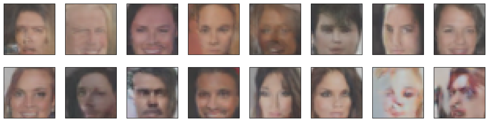

# Udacity Deep Learning Nanodegree

## Generate Faces

Build a pair of Convolutional Neural Networks and make them compete against each other in order to generate realistic faces.



### Requirements

1. Download and install [Anaconda Python](http://www.anaconda.com)
2. Create and activate a [Conda environment](http://docs.conda.io/projects/conda/en/latest/user-guide/tasks/manage-environments.html)
3. Install PyTorch and torchvision
```
conda install pytorch torchvision -c pytorch
```

### Set-up

Clone the project repository
```
git clone http://github.com/gdonatti/nd101-project-face-generation.git
```

Install required Python packages
```
cd nd101-project-face-generation
conda install --file requirements.txt
```

Launch the project Jupyter Notebook
```
jupyter notebook dlnd_face_generation.ipynb
```

### License

This project is licensed under the [MIT License](LICENSE)

### Acknowledgments

Udacity [Deep Learning Nanodegree](http://github.com/udacity/deep-learning-v2-pytorch)